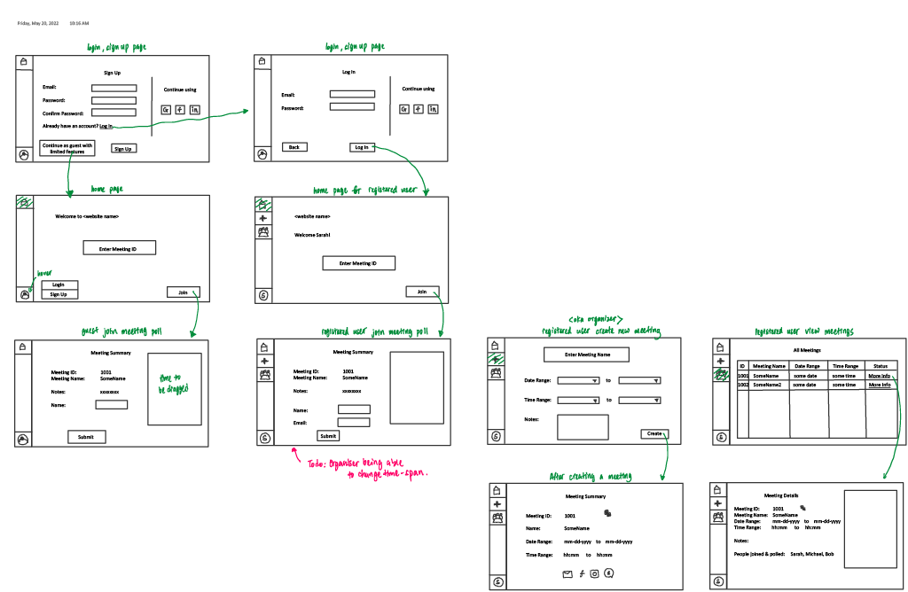

# Meeting Planner

## Project Description

### Who is it for?

People with busy calendars who need to schedule for group events/meetings

### What will it do? (What "human activity" will it support?)

Allow users to set up meetings schedules & automatically fill in availability by linking their personal calendars

### What type of data will it store?

- Meeting sessions (a calendar with availability information)
- List of users in each meeting session
- User accounts (login id & password)
- Personal calendars for each user, generated from an external source

### What will users be able to do with this data?

- Create meeting sessions
- Pull personal calendar from another data source
- Invite users
- Finalize a time on a meeting session

### What is some additional functionality you can add/remove based on time constraints?

- Polling on available times
- Timezone support
- Sending notifications once the meeting time is finalized
- Display event information on event page (eg. links, embedded map)

## Project task requirements

### Minimal requirements

- As a meeting organizer, I want to be able to create a new meeting with a given span (possible days/time) and get a unique link for it
- As a meeting attendee, I want to be able to go to the link shared by the meeting organizer and access meeting title and notes
- As a meeting attendee, I want to be able to go to that link as a guest and enter my availability by dragging my mouse across the calendar

### Standard requirements

- As a user, I want to be able to use the website as a guest, or as a registered user if I want extra features[1](#footnotes)
- As a registered user, I want to be able to delete my account
- As a meeting organizer, I want to be able to change the meeting span after creating it by logging into the account I used to create it
- As a meeting organizer, I want to be notified by email after all team members have entered their availability
- As a meeting attendee, I want to be notified after the organizer has finalized the meeting time
- As a registered user, I want to be sent an email verification to change my password when I forget the password
- As a registered user, I want to be able to use my previously entered availability for new meetings

### Stretch requirements

- All meeting attendees should be able to vote for the best meeting time from all the options provided by the website
- As an attendee, I want to be able to be send notifications once the meeting time is finalized
- As an attendee, I want to be able to create an account through some external authentication service
- As an attendee, I want to be able to log in to my account through the same external authentication service
- As the meeting organizer, I want to be able to limit access to the meeting info and availability to registered users with given email addresses

## Minimal Requirements Breakdown

**Requirement 1:** As a meeting organizer, I want to be able to create a new meeting with a given span (possible days/time) and get a unique link for it

- Create a form for inputting dates and times, to be used for selecting span
- Create a webpage where the meeting organizer can enter the meeting title and span
- Create a Submit button to send the request (meeting title and span) to the server
- Store this information in the database with a randomly generated meeting ID and send this key in the response
- Show the user a link containing this meeting ID so they they can send it to the meeting attendees

**Requirement 2:** As a meeting attendee, I want to be able to go to the link shared by the meeting organizer and access meeting title and notes

- Create a webpage for displaying meeting info and already entered availability
- Server should correctly redirect each unique link to its corresponding meeting page
- Server should serve “incorrect meeting ID” page for invalid meeting ID

## Sketch Prototypes

---
###### *Footnotes*
*1.  A user of can be either a guest or a registered user. A guest can access the features listed in Minimal Requirements, whereas a registered user can access all implemented features.*
